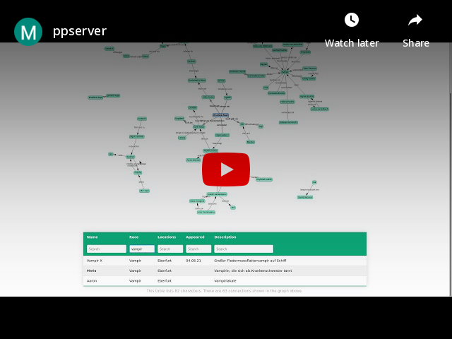

# ppserver

[](https://results.pre-commit.ci/latest/github/klieret/ppserver/master) [](https://git-scm.com/book/en/v2/GitHub-Contributing-to-a-Project) [](https://github.com/python/black) [](https://github.com/klieret/ppserver/blob/master/LICENSE.txt)

`ppserver` is a small [`flask`](https://flask.palletsprojects.com/) server that helps to keep track of story lines and characters ([NPCs](https://en.wikipedia.org/wiki/Non-player_character)) in my [pen & paper game](https://en.wikipedia.org/wiki/Tabletop_role-playing_game). The underlying data is collaboratively maintained in google sheets.

## Video

[](https://www.youtube.com/watch?v=Bz6TbnL1mEU)

## Setup

### Installing this package

```python3
pip3 install -e .
```

### Data you need

`ppserver` works of two separate google sheets:

#### `characters`

This table lists all characters in your adventures. It should have the following columns:

1. `Name`
2. `Description`
3. `Race`
4. `Appeared` (date of first appearance)
5. `Locations` (comma separated if more than one location)
6. `Keywords` (comma separated if more than one)

The following keywords are allowed:

* `player` (this is not a NPC but a player character)
* `dead` (character is deceased)

#### `relations`

This table lists the relationships between characters. It should have the following columns:

1. `Actor` (who is the relationship originating from)
2. `Relation` (what is the relation)
3. `Target` (target of the the relation)
4. `Extra` (additional keywords, comma separated if more than one)

The following keywords are allowed:

* `bi` (draw a bidirectional arrow rather than a normal arrow pointing from actor to target)

### Google API

Follow [these instructions](https://docs.gspread.org/en/latest/oauth2.html#enable-api-access-for-a-project). This involves two steps:


### Config file

Place the following file at `~/.ppserver.yaml`:

```yaml
# "share with edit rights" link to the characters sheet
character_sheet_link: https://docs.google.com/spreadsheets/d/XXXXXXXXXXXXXXXXXXXXXXXXXXXXXXXXXXXXXXXXXXXX/edit?usp=sharing
# file name of this sheet in your google drive
character_sheet_name: characters
# "share with edit rights" link to the relations sheet
relations_sheet_link: https://docs.google.com/spreadsheets/d/XXXXXXXXXXXXXXXXXXXXXXXXXXXXXXXXXXXXXXXXXXXX/edit?usp=sharing
# file name of this sheet in your google drive
relations_sheet_name: relations
# path to your certificate file
certificate_path: /home/X/Y/Z/pen-and-paper-xxxxxx-yyyyyyyyyyyy.json
```
